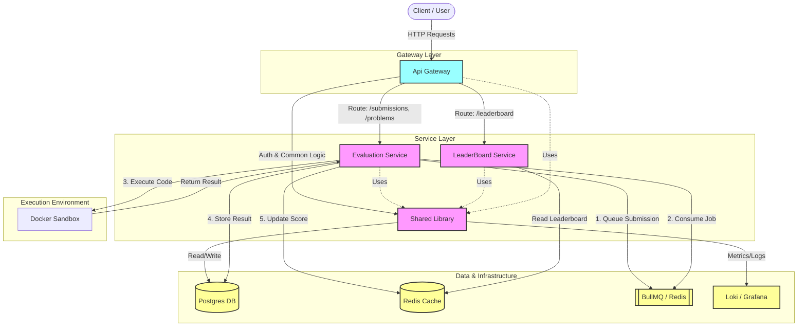

# CodeWarz Architecture

## System Overview

CodeWarz is a distributed competitive programming platform built with a microservices-inspired architecture. It consists of several specialized services working together to handle user authentication, problem processing, code evaluation, and leaderboard management.

## Architecture Diagram

## Service Descriptions

- **ApiGateway**: The entry point for all client requests, handling routing, rate limiting (potentially), and initial request validation.
- **EvaluationService**: The core computation engine. It manages problem submissions, places them in a queue, and executes them securely within a Docker sandbox.
- **LeaderBoardService**: Manages real-time leaderboards and user rankings, utilizing high-performance caching (Redis) for low-latency updates.
- **Shared**: A common library containing shared business logic, database schemas (Drizzle ORM), repository patterns, and utility functions used across all services to ensure consistency.

## Infrastructure

- **PostgreSQL**: Primary persistent storage for users, problems, submissions, and contests.
- **Redis**: Used for both distributed job queues (BullMQ) and high-speed caching for leaderboards.
- **Docker**: Provides isolated environments for safely executing user-submitted code.
- **Grafana/Loki**: Centralized logging and monitoring solution.
