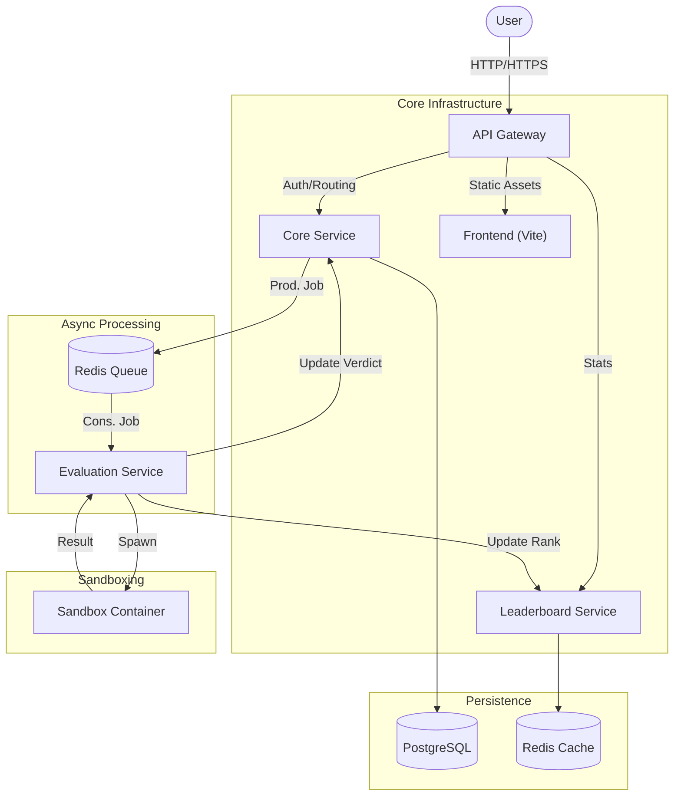

# CodeWarz


CodeWarz is a distributed, high-performance competitive programming platform engineered for scale. It isolates user-submitted code in ephemeral, secure environments while maintaining sub-millisecond latency for real-time leaderboards.

The system is designed as a set of loosely coupled microservices, enabling independent scaling of the ingestion layer, execution engine, and real-time analytics subsystems.

---

## core Architecture

The platform architecture divides responsibilities into specialized services to maximize throughput and fault tolerance.



### 1. Secure Code Execution (Sandboxing)
Security is paramount when executing untrusted user code. CodeWarz implements a **Docker-in-Docker (DinD)** strategy:
*   **Isolation**: Each submission runs in a fresh, ephemeral container with no network access.
*   **Resource Control**: Strict CPU and Memory limits (cgroups) prevent denial-of-service attacks.
*   **Host Protection**: Read-only volume mounts prevent users from modifying test cases or the execution environment.

### 2. Event-Driven Evaluation Pipeline
To handle traffic spikes during contests, the system uses an asynchronous job queue (BullMQ on Redis):
*   **Decoupling**: The API accepts submissions immediately without waiting for execution.
*   **Scalability**: The `Evaluation Service` is stateless. You can horizontally scale the number of worker replicas to process thousands of submissions per second.
*   **Reliability**: Failed jobs are automatically retried or moved to a Dead Letter Queue (DLQ) for analysis.

### 3. Real-Time Analytics
Leaderboards are powered by Redis Sorted Sets (ZSET), enabling $O(\log N)$ rank updates and retrieval. This allows the platform to broadcast live rank changes instantly as test cases pass.

---

## Technology Stack

### Backend & Systems
*   **Node.js & TypeScript**: Type-safe development across all microservices.
*   **Docker & Docker Compose**: Complete containerization of services, databases, and sandbox environments.
*   **PostgreSQL**: Relational storage for users, problems, and persistent submission history.
*   **Redis**: High-performance backing for job queues and real-time leaderboards.
*   **Prometheus & Loki**: Metrics scraping and distributed logging.

### Frontend
*   **React & Vite**: Modern, responsive user interface.
*   **TailwindCSS**: Utility-first styling for rapid UI development.

---

## Infrastructure Setup

The entire platform is fully containerized. A single command orchestrates the database, cache, gateway, and services.

### Prerequisites
*   Docker Desktop
*   Node.js v18+ (for local development)

### Quick Start

```bash
# 1. Clone the repository
git clone https://github.com/DevLikhith5/CodeWarz.git
cd CodeWarz

# 2. Build and Start Services
docker compose up --build -d

# 3. Access the Application
# Web UI: http://localhost:8080
# API Gateway: http://localhost:3000
```

---

## Engineering Design Decisions

### Why Docker-in-Docker?
We chose a DinD architecture to allow the `Evaluation Service` to programmatically spawn and destroy sibling containers on the host. This provides stronger isolation than process-level sandboxing (like `chroot`) while maintaining the flexibility to support multiple language runtimes (Python, C++, Java) simply by pulling different Docker images.

### Why Microservices?
Separating the **Core API** (CRUD, Auth) from the **Evaluation Engine** (CPU-intensive) ensures that browsing problems or checking the leaderboard remains snappy even when the judge is under heavy load.

---

## License

This project is **proprietary software**. All rights reserved.

Unauthorized copying, modification, distribution, or use of this source code, via any medium, is strictly prohibited. This repository is for **demonstration purposes only**.

---

Built by **Likhith**.
