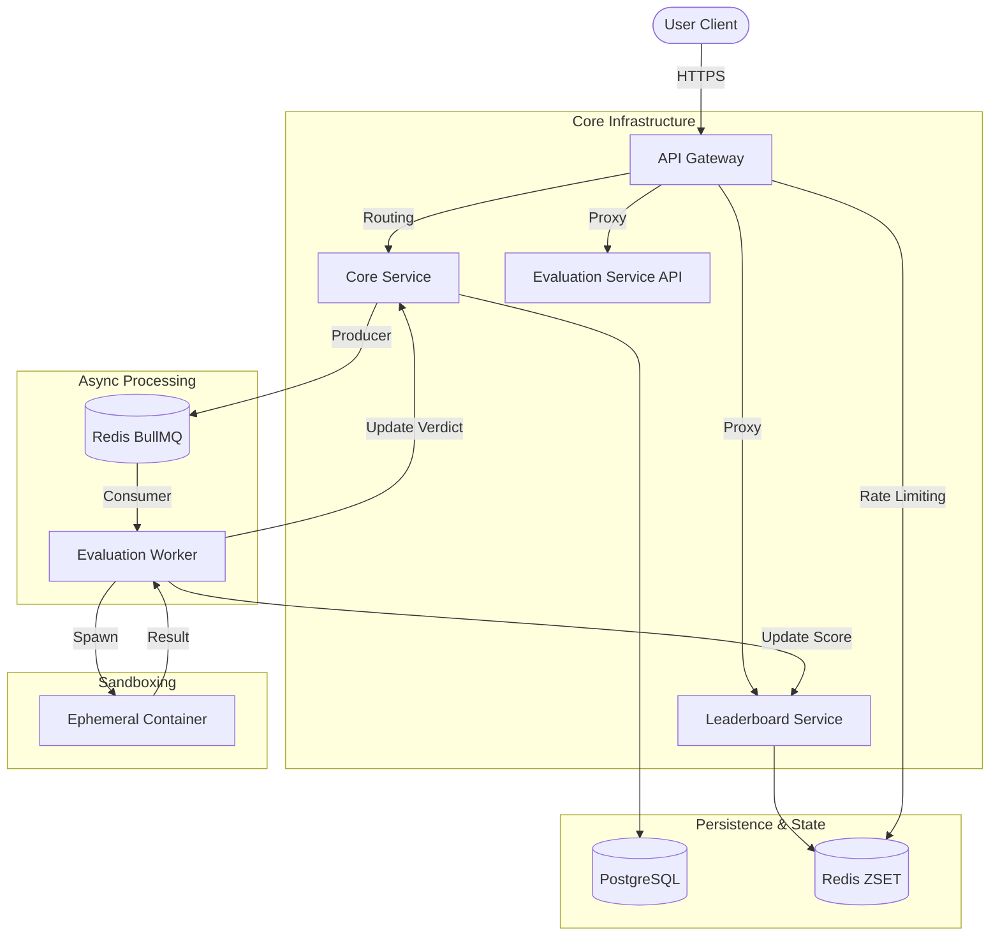

# CodeWarz


CodeWarz is a distributed, high-performance competitive programming platform designed for scale and security. It leverages a microservices architecture to isolate execution environments, ensure fault tolerance, and provide real-time leaderboard updates with sub-millisecond latency.

The system processes untrusted user code in ephemeral, secure sandboxes using a Docker-in-Docker (DinD) strategy, decoupled from the core business logic via asynchronous job queues.

## Architecture

The platform follows an event-driven microservices pattern.



## System Components

### API Gateway
A lightweight Express-based gateway that handles request routing, rate limiting, and protocol normalization. It serves as the single entry point for the frontend, directing traffic to the appropriate microservices.

### Core Service
The central management service responsible for:
-   **Authentication & Authorization**: JWT-based session management.
-   **Problem Management**: CRUD operations for problem statements and test cases.
-   **Submission Ingestion**: Validates submissions and enqueues them for processing in Redis.
-   **Data Persistence**: Manages the relational schema in PostgreSQL using Drizzle ORM.

### Evaluation Service
The stateless execution engine. It functions as a worker pool that consumes jobs from Redis.
-   **Isolation**: Spawns independent Docker containers for each submission.
-   **Security**: Enforces strict cgroups limits (CPU, Memory) and creates read-only volume mounts.
-   **Language Support**: Dynamic runtime selection based on submission metadata.

### Leaderboard Service
A dedicated service for real-time ranking.
-   **Data Structure**: Utilizes Redis Sorted Sets (ZSET) to maintain O(log N) updates for scores and ranks.
-   **High Availability**: Decoupled from the primary database to prevent read-heavy load from affecting submission processing.

## Technology Stack

### Frontend Application
Built for performance and interactivity.

| Category | Technologies |
|----------|--------------|
| **Framework** | React 18, Vite |
| **Styling** | TailwindCSS, ShadCN UI |
| **Animations** | GSAP, Framer Motion |
| **State/Data** | React Query, Zustand |
| **Editor** | Monaco Editor (VS Code core) |

### Backend Infrastructure
Built for concurrency and type safety.

| Category | Technologies |
|----------|--------------|
| **Runtime** | Node.js, TypeScript |
| **Framework** | Express.js |
| **Database** | PostgreSQL 16 (Drizzle ORM) |
| **Caching/Queues** | Redis (ioredis, BullMQ) |
| **Containerization** | Docker, Docker Compose |
| **Observability** | Prometheus, Grafana, Loki |

## Getting Started

The entire infrastructure is defined in `docker-compose.yml` for rapid deployment.

### Prerequisites
-   Docker Desktop (with Docker Compose support)
-   Node.js v18+ (optional, for local development outside containers)

### Installation

1.  **Clone the repository**
    ```bash
    git clone https://github.com/DevLikhith5/CodeWarz.git
    cd CodeWarz
    ```

2.  **Start the environment**
    This command builds the images for all services and starts the containers in detached mode.
    ```bash
    docker compose up --build -d
    ```

3.  **Access the services**
    -   **Web Interface**: [http://localhost:8080](http://localhost:8080)
    -   **API Gateway**: [http://localhost:3000](http://localhost:3000)
    -   **Grafana Dashboards**: [http://localhost:3004](http://localhost:3004)

### Development Notes
-   **Workspaces**: The `temp_workspaces` directory is mounted to the evaluation service to share source code with sandbox containers.
-   **Logs**: All services stream logs to Loki, viewable in Grafana.

## License

This project is proprietary software. All rights reserved.
