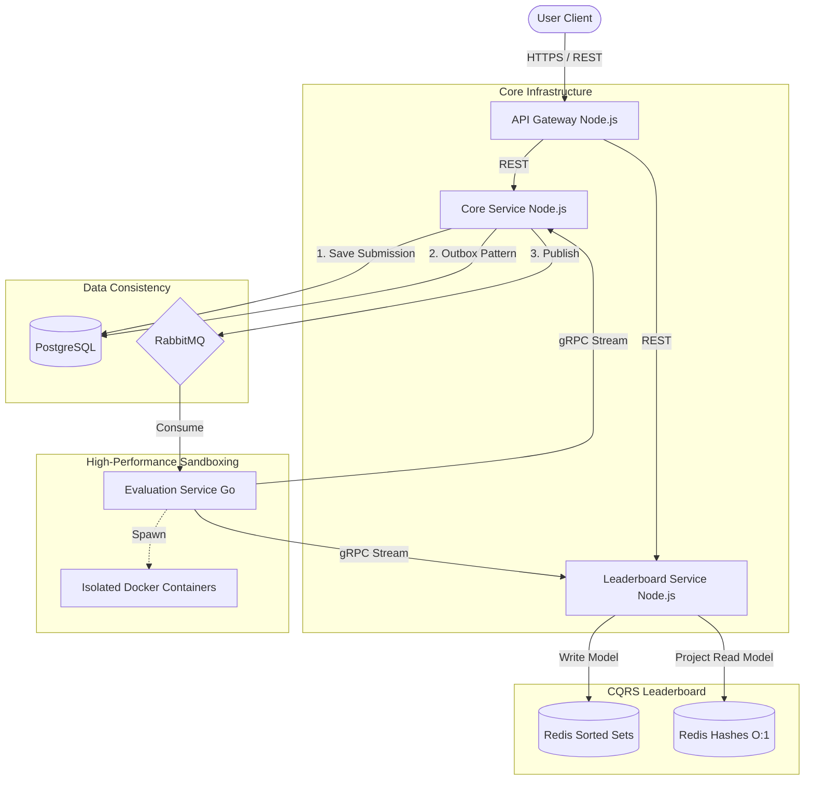

# CodeWarz


CodeWarz is a distributed, high-performance competitive programming platform built with enterprise-grade system design patterns. It handles untrusted code execution, real-time leaderboard ranking, and complex anti-cheat mechanisms across a polyglot microservice architecture.

## Advanced Architectural Patterns

This platform was built to demonstrate proficiency in handling highly concurrent distributed systems:

- **CQRS (Command Query Responsibility Segregation):** The Leaderboard Service separates the write-model (Redis Sorted Sets) from the read-model (Redis Hashes) to guarantee O(1) reads and 10x throughput without blocking evaluation pipelines.
- **Event Sourcing:** Submissions and user actions are appended to an immutable event log (`submission_events`), providing a perfect audit trail and the ability to time-travel the leaderboard state.
- **Transactional Outbox Pattern:** Guarantees atomic dual-writes. Submissions are saved to PostgreSQL and an outbox table in the same transaction before a worker safely publishes them to RabbitMQ, preventing data inconsistency.
- **gRPC:** High-throughput, low-latency inter-service communication replaces REST, utilizing Protocol Buffers for strict type safety between the TypeScript Gateway and Go Sandboxes.
- **AST Plagiarism Detection:** Deterministic tokenization and fingerprinting of Abstract Syntax Trees (similar to Stanford's MOSS) to catch structurally similar code regardless of variable renaming.
- **Chaos Engineering:** A custom Python runner that injects faults (network latency, container death) to validate the system's resilience and circuit breakers.

## System Architecture


```mermaid
graph TD
    Client([User Client]) -->|HTTPS / REST| Gateway[API Gateway Node.js]
    
    subgraph Core Infrastructure
        Gateway -->|REST| Core[Core Service Node.js]
        Gateway -->|REST| Leaderboard[Leaderboard Service Node.js]
    end

    subgraph Data Consistency
        Core -->|1. Save Submission| DB[(PostgreSQL)]
        Core -->|2. Outbox Pattern| DB
        Core -->|3. Publish| RMQ{RabbitMQ}
    end

    subgraph High-Performance Sandboxing
        RMQ -->|Consume| Eval[Evaluation Service Go]
        Eval -.->|Spawn| Sandbox[Isolated Docker Containers]
        Eval -->|gRPC Stream| Core
        Eval -->|gRPC Stream| Leaderboard
    end

    subgraph CQRS Leaderboard
        Leaderboard -->|Write Model| RedisZ[(Redis Sorted Sets)]
        Leaderboard -->|Project Read Model| RedisH[(Redis Hashes O:1)]
    end
```

## System Components

### 1. Core Service (TypeScript / Node.js)
The single source of truth for problem statements, user data, and submission tracking. It handles the Outbox pattern to safely stream events to RabbitMQ and manages the AST-based Plagiarism Detection module.

### 2. Evaluation Service (Go)
A high-concurrency stateless worker pool. It consumes code from RabbitMQ, strictly bounds resources (CPU/Memory via cgroups), and spawns ephemeral Docker-in-Docker sandboxes. Upon completion, it blasts verdicts to other services via gRPC.

### 3. Leaderboard Service (TypeScript / Node.js)
An eventually consistent CQRS engine. It consumes gRPC streams to update the raw ranking in a Redis Sorted Set (Write Model). An asynchronous projection worker then flattens this into an O(1) hash map (Read Model) so millions of users can view the leaderboard simultaneously without lag.

### 4. API Gateway (TypeScript / Node.js)
The entry point. Handles rate limiting, cache stampede prevention (via distributed locks), JWT authorization, and routes to the appropriate microservice.

### 5. Chaos Engineering (Python)
A suite that tests the system by randomly killing RabbitMQ nodes, Redis caches, or Go workers to ensure no submissions are dropped.

## Getting Started

The entire infrastructure (Services, Postgres, Redis, RabbitMQ, Jaeger, Prometheus, Grafana, Loki) is orchestrated via Docker Compose.

```bash
# Clone the repository
git clone https://github.com/DevLikhith5/CodeWarz.git
cd CodeWarz

# Spin up the cluster
docker compose up --build -d
```

### Access Points
- **Web Interface**: `http://localhost:8080`
- **API Gateway**: `http://localhost:3000`
- **Grafana (Monitoring)**: `http://localhost:3004` (admin/admin)
- **Jaeger (Distributed Tracing)**: `http://localhost:16686`
- **RabbitMQ Management**: `http://localhost:15672` (codewarz/codewarz)
