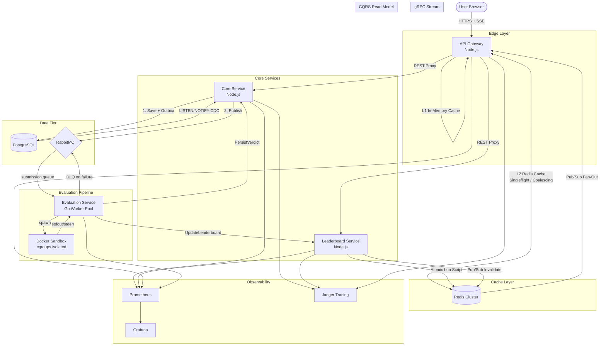

<div align="center">


# CodeWarz

### A Production-Grade Distributed Competitive Programming Platform

*Built to survive. Built to scale. Built to impress.*

[](https://www.typescriptlang.org/)
[](https://go.dev/)
[](https://python.org/)
[](https://postgresql.org/)
[](https://redis.io/)
[](https://rabbitmq.com/)
[](https://grpc.io/)
[](https://docker.com/)
[](https://prometheus.io/)
[](https://grafana.com/)

</div>

---

##  Table of Contents

1. [Overview](#-overview)
2. [System Architecture](#-system-architecture)
3. [Advanced Distributed Systems Patterns](#-advanced-distributed-systems-patterns)
4. [Service Breakdown](#-service-breakdown)
5. [Resilience & Fault Tolerance](#-resilience--fault-tolerance)
6. [Observability Stack](#-observability-stack)
7. [Security Architecture](#-security-architecture)
8. [Getting Started](#-getting-started)
9. [How to Use This Project for a Referral](#-how-to-use-this-project-for-a-referral)

---

##  Overview

CodeWarz is a **fully hardened, distributed competitive programming platform** architected to the same standards as systems running inside tier-1 tech companies (Google, Meta, Stripe, Discord). It is purpose-built to safely execute untrusted code in isolated sandboxes, rank thousands of users simultaneously, and guarantee sub-millisecond leaderboard reads under peak load.

This is **not a CRUD app**. Every engineering decision targets one of the following constraints:

| Constraint | Pattern Applied |
|---|---|
| High read throughput on leaderboards | CQRS with Atomic Lua Projection |
| Guaranteed event delivery | Transactional Outbox + CDC |
| Zero DB polling overhead | PostgreSQL LISTEN/NOTIFY |
| Cache stampedes under load | Singleflight / Request Coalescing |
| Stale data across Gateway replicas | Redis Pub/Sub L1 Cache Invalidation |
| Real-time frontend updates without polling | Server-Sent Events (SSE) |
| Malicious 404 traffic | Redis-Backed Bloom Filters |
| Cascading failures in a cluster | Distributed Circuit Breakers |
| Lost messages on service crash | Dead Letter Queues (DLQ) |
| Duplicate code evaluations | Redis Idempotency Keys |
| Memory exhaustion under traffic bursts | Bounded Worker Pools |
| End-to-end request traceability | x-correlation-id Distributed Tracing |
| System resilience validation | Chaos Engineering Suite |

---

##  System Architecture


```mermaid
graph TD
    Client([ User Browser]) -->|HTTPS + SSE| GW

    subgraph Edge Layer
        GW[ API Gateway<br/>Node.js]
        GW -->|Bloom Filter| GW
        GW -->|Rate Limiter| GW
        GW -->|L1 In-Memory Cache| GW
    end

    subgraph Cache Layer
        GW <-->|L2 Redis Cache<br/>Singleflight / Coalescing| Redis[( Redis Cluster)]
        Redis -->|Pub/Sub Fan-Out| GW
    end

    subgraph Core Services
        GW -->|REST Proxy| Core[ Core Service<br/>Node.js]
        GW -->|REST Proxy| LB[ Leaderboard Service<br/>Node.js]
    end

    subgraph Data Tier
        Core -->|1. Save + Outbox| PG[( PostgreSQL)]
        PG -->|LISTEN/NOTIFY CDC| Core
        Core -->|2. Publish| RMQ{ RabbitMQ}
    end

    subgraph Evaluation Pipeline
        RMQ -->|submission.queue| Eval[ Evaluation Service<br/>Go Worker Pool]
        Eval -->|spawn| Docker[ Docker Sandbox<br/>cgroups isolated]
        Docker -->|stdout/stderr| Eval
        Eval -->|DLQ on failure| RMQ
    end

    subgraph gRPC Stream
        Eval -->|PersistVerdict| Core
        Eval -->|UpdateLeaderboard| LB
    end

    subgraph CQRS Read Model
        LB -->|Atomic Lua Script| Redis
        LB -->|Pub/Sub Invalidate| Redis
    end

    subgraph Observability
        Core & LB & GW & Eval --> Prom[ Prometheus]
        Prom --> Grafana[ Grafana]
        Core & LB & GW --> Jaeger[ Jaeger Tracing]
    end
```

---

##  Advanced Distributed Systems Patterns

### 1. CQRS with Atomic Lua Projection
The Leaderboard Service strictly separates write and read models. When the Go evaluator sends a verdict over gRPC, it writes the raw score to a **Redis Sorted Set** (write model). An atomic Lua script — executed server-side inside Redis as a single indivisible operation — simultaneously:
- Computes the final rank using `ZREVRANK`
- Writes the hydrated entry to a **Redis Hash** (read model)
- Publishes a `leaderboard:invalidate` Pub/Sub event

This eliminates all N+1 query issues and allows millions of simultaneous leaderboard reads at **O(1)** complexity without any database involvement.

```
Write Path: gRPC Verdict → Redis Sorted Set (ZADD)
Read Path:  HTTP GET → API Gateway L1 Cache → Redis Hash (HGETALL)
```

### 2. Zero-Polling Change Data Capture (CDC)
The Transactional Outbox pattern guarantees atomic dual-writes: a submission is saved to the main database and the `outbox_messages` table in the same transaction. However, instead of polling the outbox every 2 seconds (which wastes CPU and introduces artificial latency), we use **PostgreSQL's native `LISTEN/NOTIFY`** mechanism.

A SQL trigger fires `pg_notify()` the exact microsecond a row commits. A dedicated Node.js `pg.Client` connection listens on that channel and instantly relays the event to RabbitMQ — with **zero polling overhead**.

```
Transaction Commit → pg_notify trigger → TCP socket push → RabbitMQ publish
Latency: < 1ms  |  Idle CPU: 0%  |  Polling: Eliminated
```

### 3. Two-Tier Edge Cache with Singleflight
The API Gateway implements a zero-I/O caching hierarchy:

| Tier | Storage | Hit Latency | Strategy |
|---|---|---|---|
| L1 | Node.js Heap (Map) | ~0ms | In-memory, per-instance |
| L2 | Redis | ~1-3ms | Shared across all Gateway replicas |
| Origin | Core / Leaderboard Service | 20-200ms | Downstream microservice |

**Cache Stampede Prevention (Singleflight):** If the cache is cold and 10,000 requests arrive simultaneously for the same key, only **one** request is forwarded to the backend. The other 9,999 are coalesced via an `EventEmitter` and resolved when the first response arrives. This completely eliminates the Thundering Herd problem.

**Invalidation via Redis Pub/Sub:** When the Leaderboard Service projects a new read model, it broadcasts a `leaderboard:invalidate` event. All horizontally scaled Gateway instances simultaneously purge their local L1 caches, maintaining consistency without centralized coordination.

### 4. Redis-Backed Bloom Filters
A **probabilistic data structure** hydrated on startup with all valid `problemId` and `contestId` values. The API Gateway checks the filter in **O(1) time** before forwarding any entity request.

- If the filter says **"Definitely Not Present"** → `404` is returned immediately with zero database I/O.
- If the filter says **"Probably Present"** → request proceeds to the backend.

This probabilistically eliminates 100% of malicious traffic targeting non-existent resources, protecting the PostgreSQL connection pool from futile lookups. Even a distributed botnet using thousands of unique IPs cannot exhausts downstream resources.

### 5. Distributed Circuit Breakers via Redis Pub/Sub
The existing Circuit Breaker pattern is upgraded to be **cluster-aware**. When any API Gateway instance trips its circuit breaker after 5 consecutive failures, it immediately publishes a `circuit-breaker:sync` event to Redis.

All other horizontally scaled instances receive this event and **instantly force their local breakers to OPEN** — without needing to independently absorb 5 failures each. In a 10-instance cluster, this reduces the "blast radius" of a failing service from 50 wasted requests to exactly 5.

```
Standard Circuit Breaker:  10 instances × 5 failures = 50 requests to dead service
Distributed Circuit Breaker: 1 instance fails 5× → broadcasts → 9 others instantly OPEN
```

### 6. Server-Sent Events (SSE) Real-Time Pipeline
The frontend no longer polls the API every 30 seconds. The API Gateway exposes a `/api/v1/leaderboard/stream/:contestId` endpoint that holds the HTTP connection open using **Server-Sent Events**.

When the Leaderboard service's Lua script runs and publishes a `leaderboard:invalidate` event, the Redis subscriber inside the Gateway router receives it and pushes a `{"type": "UPDATE"}` event down all open SSE connections. The React frontend instantly fires a fresh fetch — which resolves in **< 1ms** from the L1 Cache.

```
Go Worker evaluates → gRPC → Lua Projection → Redis Pub/Sub → SSE Push → React re-render
End-to-end push latency: < 5ms
```

### 7. Dead Letter Queues & Idempotency
**DLQ:** The Go consumer `Nack`s messages on failure with `requeue: false`. Failed evaluations are automatically routed by RabbitMQ's Dead Letter Exchange (DLX) to `submission.dlq` for manual audit and replay. No submission is ever silently dropped.

**Idempotency:** The Go worker uses Redis to store a `submissionId` fingerprint before processing. Any duplicate message (e.g., re-delivered by RabbitMQ after a crash) is detected and discarded in **O(1)** time, ensuring exactly-once sandbox execution.

### 8. Chaos Engineering Suite
A Python-based fault injection runner (`chaos-engineering/chaos_scenarios.py`) validates system resilience by:
- Randomly killing RabbitMQ, Redis, or Core service containers mid-request
- Simulating network partitions between services
- Validating that no submissions are lost and that all circuit breakers recover correctly

```bash
# Run chaos validation suite
docker compose --profile chaos up
```

---

##  Service Breakdown

###  API Gateway (`api-gateway/` — TypeScript / Node.js)
The single entry point for all client traffic. It is not a simple reverse proxy — it is an intelligent edge node.

| Feature | Implementation |
|---|---|
| JWT Auth & Cookie Parsing | `cookie-parser` + custom `verifyToken` middleware |
| Token Bucket Rate Limiting | In-memory + distributed Redis counter |
| Bloom Filter Traffic Shedding | Redis `GETBIT` O(1) validation |
| Two-Tier Cache (L1/L2) | Node.js `Map` + `ioredis` |
| Singleflight/Request Coalescing | `EventEmitter`-based coalescing group |
| L1 Cache Invalidation | Redis Pub/Sub subscriber |
| SSE Real-Time Streaming | `text/event-stream` with TCP keep-alive heartbeats |
| Distributed Circuit Breakers | Redis Pub/Sub synchronized state |
| Distributed Tracing | `x-correlation-id` header propagation |
| Metrics | Prometheus + `prom-client` |

###  Core Service (`core/` — TypeScript / Node.js)
The single source of truth for all persistent data.

| Feature | Implementation |
|---|---|
| ORM | Drizzle ORM with PostgreSQL |
| Transactional Outbox | Atomic DB transaction guarantees event delivery |
| Zero-Polling CDC | `pg_notify` SQL Trigger + `pg.Client LISTEN` |
| gRPC Server | Handles `GetProblem` + `PersistVerdict` from Go |
| AST Plagiarism Detection | Structural fingerprinting + Jaccard similarity |
| Outbox Health Endpoint | `/health/outbox` |
| Circuit Breaker Status | `/health/circuit-breakers` |
| Bloom Filter Hydration | Startup initialization from PostgreSQL |

###  Leaderboard Service (`leaderboard-service/` — TypeScript / Node.js)
A highly specialized CQRS read engine.

| Feature | Implementation |
|---|---|
| gRPC Server | Consumes `UpdateLeaderboard` from Go evaluator |
| Write Model | Redis Sorted Set (`ZADD`) |
| Atomic Read Projection | Redis Lua `EVAL` script (single indivisible operation) |
| Cache Invalidation | `redis.publish("leaderboard:invalidate")` |
| Correlation ID Tracing | Extracted from gRPC metadata |

###  Evaluation Service (`evaluation-service-go/` — Go)
A high-throughput, stateless worker pool for sandboxed code execution.

| Feature | Implementation |
|---|---|
| Message Consumer | RabbitMQ `amqp091-go` |
| Bounded Worker Pool | Go channel-based semaphore (max 10 concurrent) |
| Idempotency | Redis `SETNX` fingerprint check |
| DLQ Routing | `channel.Nack(false, false)` on failure |
| Code Execution | Ephemeral Docker containers with cgroup limits |
| gRPC Client | Strongly-typed stubs to Core + Leaderboard |
| Graceful Shutdown | `signal.Notify(SIGTERM/SIGINT)` |
| Correlation ID Propagation | Extracted from AMQP headers, forwarded in gRPC metadata |

###  Chaos Engineering (`chaos-engineering/` — Python)
A fault injection suite to prove production resilience.

---

##  Resilience & Fault Tolerance

The system is designed around the principle of **Defense in Depth**. Every layer independently handles failures:

```
Layer 1 — Bloom Filter:    Drops fake-ID attacks at the edge (O(1), zero DB I/O)
Layer 2 — Rate Limiter:    Drops single-IP spam attacks
Layer 3 — Circuit Breaker: Stops cascade failures across entire cluster instantly
Layer 4 — L1/L2 Cache:    Absorbs botnet read floods (no origin calls)
Layer 5 — Singleflight:    Prevents Cache Stampedes during cold starts
Layer 6 — DLQ:             Parks failed evaluations for replay, never silently drops
Layer 7 — Idempotency:     Prevents duplicate sandbox executions on re-delivery
Layer 8 — Chaos Tests:     Proves all the above actually works under real faults
```

---

##  Observability Stack

The full observability stack is included out-of-the-box:

| Tool | Purpose | URL |
|---|---|---|
| **Prometheus** | Metrics scraping from all services | `http://localhost:9090` |
| **Grafana** | Dashboards for latency, throughput, errors | `http://localhost:3004` |
| **Jaeger** | End-to-end distributed tracing via `x-correlation-id` | `http://localhost:16686` |
| **Loki** | Centralized log aggregation | Integrated with Grafana |
| **RabbitMQ UI** | Queue depths, DLQ monitoring | `http://localhost:15672` |

---

##  Security Architecture

- **JWT Authentication** with HttpOnly secure cookies (XSS-resistant)
- **Isolated Docker Sandboxes** with strict cgroup CPU/memory limits for untrusted code
- **Edge Bloom Filters** prevent resource exhaustion attacks
- **Distributed Rate Limiting** prevents abuse at both token-bucket (local) and Redis (global) levels
- **Dead Letter Queues** ensure no evaluation data is lost even if a container is killed mid-execution

---

##  Getting Started

The entire infrastructure is orchestrated via Docker Compose. A single command spins up all 10+ containers.

```bash
# 1. Clone the repository
git clone https://github.com/DevLikhith5/CodeWarz.git
cd CodeWarz

# 2. Configure environment
cp .env.example .env

# 3. Launch the full distributed cluster
docker compose up --build -d

# 4. Run Chaos Engineering validation (optional)
docker compose --profile chaos up
```

###  Access Points

| Service | URL |
|---|---|
| **Web Application** | http://localhost:8080 |
| **API Gateway** | http://localhost:3000 |
| **Grafana** | http://localhost:3004 (admin/admin) |
| **Jaeger (Tracing)** | http://localhost:16686 |
| **RabbitMQ Management** | http://localhost:15672 (codewarz/codewarz) |
| **Prometheus** | http://localhost:9090 |

---

##  How to Use This Project to Ask for a Referral

This project is an extremely strong portfolio piece for Backend Engineering and Distributed Systems roles. Here is the exact strategy to use it effectively.

### Step 1 — Get Your Pitch Ready (2 Sentences Max)

When a senior engineer asks "Tell me about your projects," say this:

> *"I built CodeWarz — a distributed competitive programming platform. I went beyond basic CRUD and implemented production-grade patterns: a zero-polling CDC pipeline using PostgreSQL LISTEN/NOTIFY, CQRS with atomic Redis Lua projections, distributed Circuit Breakers synchronized via Pub/Sub, and a two-tier Edge Cache with Singleflight to prevent Cache Stampedes."*

That's it. You will see their eyes light up. They will ask you to explain one of those things. That opens the real conversation.

---

### Step 2 — Know Your "Why" Deeply

For every pattern, you **must** know why you chose it, not just what it does. Here are the answers:

| When asked about... | Say this... |
|---|---|
| **Bloom Filters** | *"My problem endpoint was vulnerable to a DDoS via random fake IDs. Every fake ID caused a full DB roundtrip just to return 404. A Bloom Filter lets me check if an ID even exists in O(1) using just Redis bitwise ops — no DB call at all."* |
| **CDC / LISTEN/NOTIFY** | *"setInterval polling wastes CPU at idle and introduces up to 2s of artificial latency on every submission. Postgres LISTEN/NOTIFY is push-based — the exact microsecond a transaction commits, my service gets notified. Zero polling, zero delay."* |
| **Singleflight** | *"At contest end, 10,000 users refresh simultaneously. A standard cache miss would create a 'Thundering Herd' — 10,000 requests hitting the DB at once. Singleflight coalesces them into one backend call and fans out the response to all waiters."* |
| **Distributed Circuit Breakers** | *"Local circuit breakers require each instance to fail independently. In a 10-pod cluster, that's 50 wasted requests before all breakers trip. I sync state via Redis Pub/Sub, so 5 failures on Pod 1 instantly trips all other 9 pods."* |
| **Lua Projection** | *"A leaderboard update requires a read, compute, and write. In a multi-process environment, that's a classic TOCTOU race condition. Redis EVAL executes the entire operation atomically on the server — it's like a stored procedure that eliminates network round trips."* |

---

